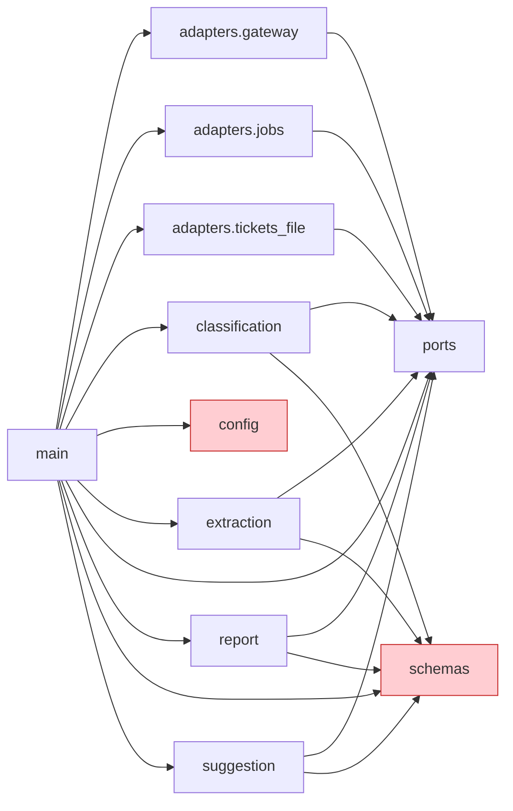

# Dependências entre componentes: main

```mermaid
graph LR
    c0["adapters.gateway"]
    c1["adapters.jobs"]
    c2["adapters.tickets_file"]
    c3["classification"]
    c4["config"]
    c5["extraction"]
    c6["main"]
    c7["ports"]
    c8["report"]
    c9["schemas"]
    c10["suggestion"]
    c0 --> c7
    c1 --> c7
    c2 --> c7
    c3 --> c7
    c3 --> c9
    c5 --> c7
    c5 --> c9
    c6 --> c0
    c6 --> c1
    c6 --> c2
    c6 --> c3
    c6 --> c4
    c6 --> c5
    c6 --> c7
    c6 --> c8
    c6 --> c9
    c6 --> c10
    c8 --> c7
    c8 --> c9
    c10 --> c7
    c10 --> c9
    classDef dor fill:#ffcdd2,stroke:#c62828
    class c4,c9 dor
```

Em vermelho, os componentes na zona de dor (A < 0,5, I < 0,5 e D ≥ 0,5).

## Ciclos

Nenhum ciclo de dependência.
